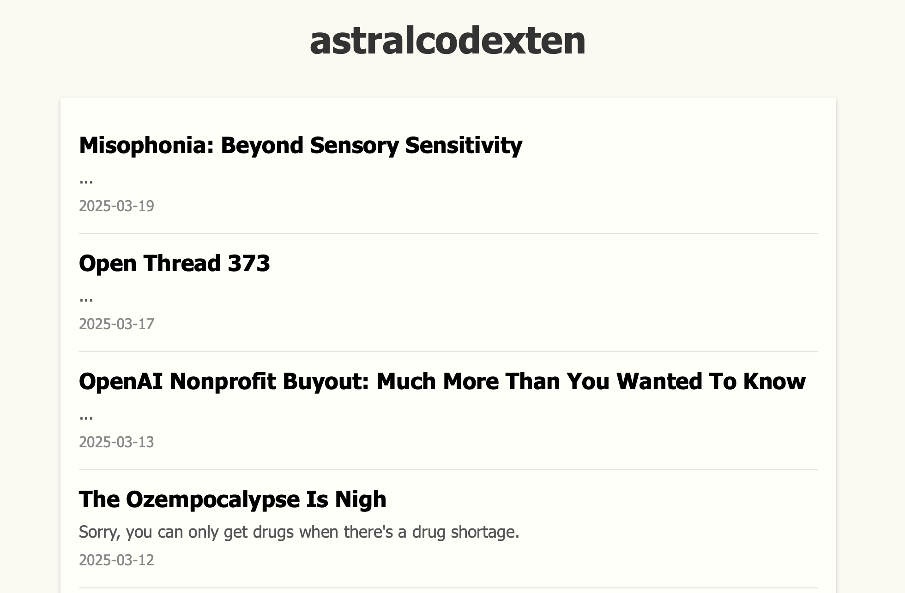

# Substack2Markdown Lite

Substack2Markdown Lite is a Python tool for downloading free and premium Substack posts and saving them as both Markdown and HTML files, and includes a simple HTML interface to browse and sort through the posts. It will save paid for content as long as you're subscribed to that substack.



Once you run the script, it will create a folder named after the substack in `/md`,
and then begin to scrape the substack URL, converting the blog posts into markdown files. Once all the posts have been
saved, it will generate an HTML file in `/html` directory that allows you to browse the posts.

You can either hardcode the substack URL and the number of posts you'd like to save into the top of the file, or specify them as command line arguments.

## Features

- Converts Substack posts into Markdown files.
- Generates an HTML file to browse Markdown files.
- Supports free and premium content (with subscription).

## Installation

Clone the repo and install the dependencies:

```bash
git clone https://github.com/yourusername/substack_scraper.git
cd substack_scraper

# # Optinally create a virtual environment
# python -m venv venv
# # Activate the virtual environment
# .\venv\Scripts\activate  # Windows
# source venv/bin/activate  # Linux

pip install -r requirements.txt
```

For the premium scraper, update the `config.py` in the root directory with your Substack email and password:

```python
EMAIL = "your-email@domain.com"
PASSWORD = "your-password"
```

## Usage

Specify the Substack URL and the directory to save the posts to:

You can hardcode your desired Substack URL and the number of posts you'd like to save into the top of the file and run:

```bash
python substack_scraper.py
```

For free Substack sites:

```bash
python substack_scraper.py --url https://example.substack.com --directory /path/to/save/posts
```

For premium Substack sites:

```bash
python substack_scraper.py --url https://example.substack.com --directory /path/to/save/posts --premium
```

To scrape a specific number of posts:

```bash
python substack_scraper.py --url https://example.substack.com --directory /path/to/save/posts --number 5
```

## Contributing

Hard fork from [https://github.com/timf34/Substack2Markdown](https://github.com/timf34/Substack2Markdown)
